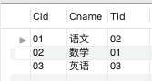
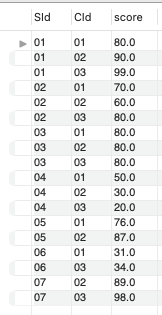
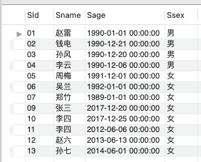

***Class Table***


***Teacher Table***


***Score Table***


***Student Table***



#1. 查询" 01 "课程比" 02 "课程成绩高的学生的信息及课程分数
```
select
*
from student
where exists (
select
tb1.sid
from sc tb1
join sc tb2
on tb1.sid = tb2.sid and tb1.cid = tb2.cid - 1
where tb1.cid = 01 and tb1.score > tb2.score and student.sid = tb1.sid);
```
#1.1 查询同时存在" 01 "课程和" 02 "课程的情况
```
select
sid
from sc a
where cid = 02 and exists
(select 
sid
from sc b
where cid = 01 AND a.sid = b.sid);
```
#1.2 查询存在" 01 "课程但可能不存在" 02 "课程的情况(不存在时显示为 null )
```
select
tb1.sid, tb1.cid, tb1.score, tb2.cid, tb2.score
from (select * from sc where cid = 01) tb1
left join (select * from sc where cid = 02) tb2
on tb1.sid = tb2.sid;
```
#1.3 查询不存在" 01 "课程但存在" 02 "课程的情况
```
select
sid
from sc a
where not exists
(select
sid
from sc b
where cid = 01 and a.sid = b.sid)
and cid = 02;
```
#2.查询平均成绩大于等于60分的同学的学生编号和学生姓名和平均成绩 
```
select
s.sid, s.sname, avg(score) as average_score
from sc
join student s on sc.sid = s.sid
group by s.sid, s.sname
having avg(score) >= 60;
```
#3.查询在 SC 表存在成绩的学生信息
```
select
sid, sname
from student
where exists (
select
distinct sid
from sc 
where student.sid = sc.sid);
```
#4.查询所有同学的学生编号、学生姓名、选课总数、所有课程的总成绩(没成绩的显示为 null ) 
```
select
s.sid, s.sname, num, total_score
from student s
left join
(select
sid, count(cid) as num, sum(score) as total_score
from sc
group by sid) tb1
on s.sid = tb1.sid;
```
#4.1 查有成绩的学生信息
```
select
*
from student 
where exists (select distinct sid from sc where sc.sid = student.sid);
```
#5.查询「李」姓老师的数量
```
select
count(*)
from teacher
where tname like '李%';
```
#6.查询学过「张三」老师授课的同学的信息
```
select
distinct sid
from sc
where cid in
(select
cid
from course
where tid = (select tid from teacher where tname = '张三'));
```
#7.查询没有学全所有课程的同学的信息
```
select
sid
from sc
group by sid
having count(cid) = (select count(cid) from course);
```
#8.查询至少有一门课与学号为" 01 "的同学所学相同的同学的信息
```
select
distinct sid
from sc
where cid in 
(select
cid
from sc
where sid = 01)
and sid != 01;
```
#9.查询和" 01 "号的同学学习的课程 完全相同的其他同学的信息
```
with tb1 as (
select
sid, cid
from sc
where sid = 01) 

select
tb2.sid
from (select * from sc where sid != 01) tb2
join tb1
on tb1.cid = tb2.cid
group by tb2.sid
having count(tb1.cid) = (select count(cid) from tb1);
```
#10.查询没学过"张三"老师讲授的任一门课程的学生姓名
```
with tb1 as (
select 
tid
from teacher
where tname = '张三')

select
sid
from student
where sid not in (
select
distinct sid
from sc a
where exists (select sid from sc b where cid in (select tid from tb1) and a.sid = b.sid ));
```
#11.查询两门及其以上不及格课程的同学的学号，姓名及其平均成绩
```
with tb1 as (
select
sid,
sum(case when score < 60 then 1 else 0 end) as fail
from sc
group by sid)

, tb2 as (
select
sid
from tb1
where fail >= 2)

, tb3 as (
select
sid, avg(score) as average
from sc
where sid in (select sid from tb2)
group by sid)

select
s.sid, s.sname, average
from tb3 
join student s
on tb3.sid = s.sid;
```
#12.检索" 01 "课程分数小于 60，按分数降序排列的学生信息
```
select
sid
from sc
where cid = 01 and score < 60
order by sid desc;
```
#13.按平均成绩从高到低显示所有学生的所有课程的成绩以及平均成绩
```
with tb1 as (
select
sid, avg(score) as average
from sc
group by sid)

select
*
from sc
join tb1
on sc.sid = tb1.sid
order by average desc;
```
#14.查询各科成绩最高分、最低分和平均分： 
-- 以如下形式显示：课程 ID，课程 name，最高分，最低分，平均分，及格率，中等率，优良率，优秀率 
-- 及格为>=60，中等为：70-80，优良为：80-90，优秀为：>=90 要求输出课程号和选修人数，查询结果按人数降序排列，若人数相同，按课程号升序排列
```
with tb1 as (
select
cid, max(score), min(score), avg(score) as average, 
sum(case when score >= 60 then 1 else 0 end)/count(*) as pass_rate, 
sum(case when score between 70 and 80 then 1 else 0 end)/count(*) as ok_rate, 
sum(case when score between 80 and 90 then 1 else 0 end)/count(*) as good_rate, 
sum(case when score >= 90 then 1 else 0 end)/count(*) as excellence_rate,
count(*) as num_of_student
from sc
group by cid)

select * 
from tb1
order by num_of_student desc, cid asc;
```
#15.按各科成绩进行排序，并显示排名， Score 重复时保留名次空缺 
```
select
cid, 
sid, 
score,
rank() over(partition by cid order by score desc) as rnk
from sc;
```
#15.1 按各科成绩进行排序，并显示排名， Score 重复时合并名次
```
select
cid, 
sid, 
score,
dense_rank() over(partition by cid order by score desc) as rnk
from sc;
```
#16.查询学生的总成绩，并进行排名，总分重复时保留名次空缺 
```
with tb1 as (
select
sid, sum(score) as total_score
from sc
group by sid)

select
sid,
rank() over(order by total_score) as rnk
from tb1;
```
-- 16.1 查询学生的总成绩，并进行排名，总分重复时不保留名次空缺
```
with tb1 as (
select
sid, sum(score) as total_score
from sc
group by sid)

select
sid,
dense_rank() over(order by total_score) as rnk
from tb1;
```
#17.统计各科成绩各分数段人数：课程编号，课程名称，[100-85]，[85-70]，[70-60]，[60-0] 及所占百分比
```
with tb1 as (
select
sc.cid, c.cname, sc.score
from sc 
join course c
on sc.cid = c.cid)

select
cid, cname,
sum(case when score between 0 and 60 then 1 else 0 end)/count(*) as '[60-0]',
sum(case when score between 60 and 70 then 1 else 0 end)/count(*) as '[60-70]',
sum(case when score between 70 and 85 then 1 else 0 end)/count(*) as '[70-85]',
sum(case when score between 85 and 100 then 1 else 0 end)/count(*) as '[85-100]'
from tb1
group by cid, cname;
```
#18.查询各科成绩前三名的记录
```
with tb1 as (
select
cid,
score,
rank() over(partition by cid order by score desc) as rnk
from sc)

select
*
from tb1
where rnk <= 3;
```
#19.查询每门课程被选修的学生数
```
select
cid, count(1)
from sc
group by cid;
```
#20.查询出只选修两门课程的学生学号和姓名
```
select
sid
from sc
group by sid
having count(cid) = 2;
```
#21.查询男生、女生人数
```
select
sum(case when ssex = '男' then 1 else 0 end) as boy_cnt,
sum(case when ssex = '女' then 1 else 0 end) as girl_cnt
from student;
```
#22.查询名字中含有「风」字的学生信息
```
select
*
from student
where sname like '%风%';
```
#23.查询同名同性学生名单，并统计同名人数
```
select
sname, count(sname) as cnt
from student
group by sname
having count(sname) > 1;
```
#24.查询 1990 年出生的学生名单
```
select
*
from student
where year(sage) = 1990;
```
#25.查询每门课程的平均成绩，结果按平均成绩降序排列，平均成绩相同时，按课程编号升序排列
```
select
cid, avg(score) as average
from sc
group by cid
order by avg(score) desc, cid;
```
#26.查询平均成绩大于等于 85 的所有学生的学号、姓名和平均成绩
```
select
sid
from sc
group by sid
having avg(score) >= 85;
```
#27.查询课程名称为「数学」，且分数低于 60 的学生姓名和分数
```
select
sid, score
from sc
where cid = 02 and score < 60;
```
#28.查询所有学生的课程及分数情况（存在学生没成绩，没选课的情况）
```
select
s.sid, s.sname, s.sage, s.ssex, sc.cid, sc.score
from student s
left join sc
on s.sid = sc.sid;
```
#29.查询任何一门课程成绩在 70 分以上的姓名、课程名称和分数
```
select
*
from sc
where score > 70;
```
#30.查询不及格的课程
```
select
*
from sc
where score < 70;
```
#31.查询课程编号为 01 且课程成绩在 80 分以上的学生的学号和姓名
```
select
*
from sc
where cid = 01 and score >= 80;
```
#32.求每门课程的学生人数
```
select
cid, count(1) as num
from sc
group by cid;
```
#33.假设成绩不重复，查询选修「张三」老师所授课程的学生中，成绩最高的学生信息及其成绩
```
with tb1 as (
select
cid
from course
where tid = 01)

select
sid
from sc
where cid in (select cid from tb1)
order by score desc limit 1;
```
#34.假设成绩有重复的情况下，查询选修「张三」老师所授课程的学生中，成绩最高的学生信息及其成绩
```
with tb1 as (
select
cid
from course
where tid = 01)

select
score
from sc
where cid in (select cid from tb1)
and score =
(select
score
from sc
where cid in (select cid from tb1)
order by score desc limit 1);
```
#35.查询不同课程成绩相同的学生的学生编号、课程编号、学生成绩
```
select
*
from sc as a
join sc as b
on  a.sid <> b.sid and a.cid <> b.cid and a.score = b.score;
```
#36.查询每门功成绩最好的前两名
```
select
*
from
(select
cid,
sid,
score,
dense_rank() over(partition by cid order by score desc) as rnk
from sc) tb1
where rnk <= 2;
```
#37.统计每门课程的学生选修人数（超过 5 人的课程才统计）。
```
select
cid, count(cid) as cnt
from sc
group by cid
having count(cid) > 5;
```
#38.检索至少选修两门课程的学生学号
```
select
sid
from sc
group by sid
having count(sid) >= 2;
```
#39.查询选修了全部课程的学生信息
```
select
sc.sid
from sc
left join course c
on sc.cid = c.cid
group by sid
having count(c.cid) = 3;
```
#40.查询各学生的年龄，只按年份来算
```
select sname, current_dt - dob
from
(select
sname, year(NOW()) as current_dt, year(sage) as dob
from student) tb1;
```
#41.按照出生日期来算，当前月日 < 出生年月的月日则，年龄减一
```
select sname,  if(right(current_dt,5) < right(dob,5), current_dt-dob-1, current_dt-dob) as age
from
(select
sname, left(NOW(),10) as current_dt, left(sage,10) as dob
from student) tb1;
```
#42.查询本周过生日的学生
```
select
*
from student
where month(sage) = 
(select
week(now()));
```
#43.查询下周过生日的学生
```
select
*
from student
where month(sage) = 
(select
week(now()) + 1);
```
#44.查询本月过生日的学生
```
select
*
from student
where month(sage) = 
(select
month(now()));
```
#45.查询下月过生日的学生
```
select
*
from student
where month(sage) = 
(select
month(now()) + 1);
```
